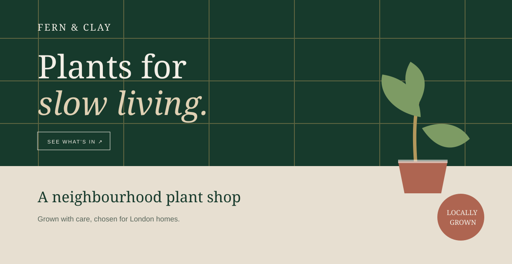

# Fern & Clay



A warm, editorial landing page for **Fern & Clay**, an independent plant shop and greenhouse in Stoke Newington, London.

The page includes:

- A greenhouse-inspired hero section
- Featured plants and pricing
- Practical plant-care services
- Small-group workshops
- Local delivery information
- Shop address, opening hours, and accessibility details

## Stack

- React 19
- Vinext
- Vite
- TypeScript
- Tailwind CSS

## Run locally

```bash
npm install
npm run dev
```

Then open the local URL shown in the terminal.

## Available scripts

```bash
npm run dev      # Start the development server
npm run build    # Create a production build
npm run start    # Serve the production build with Wrangler
npm run lint     # Run Oxlint
npm run format   # Format the project with Oxfmt
```

Plant photography is loaded from Unsplash and the preview image above is a local SVG included for the project README.
